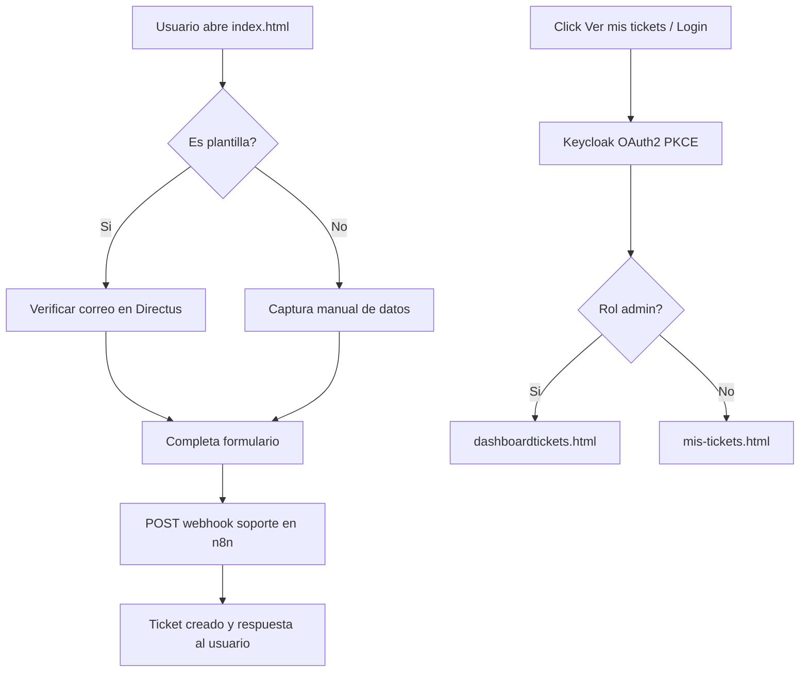

# Soporte PLAi

Aplicacion web para mesa de ayuda con autenticacion SSO (Keycloak), creacion de tickets y visualizacion de tickets por perfil (usuario o admin).

## Objetivo del proyecto

Centralizar solicitudes de soporte en una interfaz simple y moderna que permita:

- Crear tickets con clasificacion automatica.
- Adjuntar evidencias (imagenes).
- Consultar tickets propios.
- Gestionar tickets globales desde un dashboard admin.

## Funcionalidades principales

- Formulario de soporte en `index.html`.
- Validacion de empleados contra Directus para usuarios de plantilla.
- Carga de adjuntos (PNG, JPG/JPEG, WEBP) con limite de 3 archivos y 5MB por archivo.
- Flujo SSO con Keycloak usando OAuth2 + PKCE.
- Redireccion por rol:
  - Admin -> `dashboardtickets.html`
  - Usuario -> `mis-tickets.html`
- Dashboard de usuario con sus tickets y KPIs de prioridad.
- Dashboard admin con filtros, paginacion, auto-actualizacion y previsualizacion de adjuntos.

## Stack

- HTML5
- CSS3
- JavaScript (vanilla)
- Integraciones externas:
  - Keycloak (autenticacion)
  - n8n (webhooks y consulta de tickets)
  - Directus (validacion de empleados)

## Estructura del proyecto

```text
Soporte-PLAi/
|-- index.html                # Formulario principal + acceso "Ver mis tickets"
|-- login.html                # Pantalla de login SSO con Keycloak
|-- mis-tickets.html          # Vista de tickets para usuarios
|-- dashboardtickets.html     # Vista administrativa de tickets
|-- KEYCLOAK_INTEGRATION.md   # Detalle tecnico del flujo Keycloak
|-- Imagenes/                 # Recursos estaticos (logo, etc.)
```

## Arquitectura funcional



## Flujo de autenticacion

1. El usuario inicia sesion desde `index.html` o `login.html`.
2. Se genera `state` y `code_verifier` (PKCE) en navegador.
3. Keycloak devuelve `code` al callback.
4. El frontend intercambia `code` por tokens.
5. Se guardan datos de sesion en `sessionStorage`.
6. Se redirige segun rol.

Para mas detalle revisa: `KEYCLOAK_INTEGRATION.md`.

## Variables y endpoints importantes

Actualmente hay valores definidos directamente en los HTML (hardcoded), por ejemplo:

- Keycloak:
  - `KC_CONFIG` en `index.html`
  - `KC` en `login.html`
  - `_KC` en `mis-tickets.html` y `dashboardtickets.html`
- Webhooks n8n:
  - Creacion de ticket: `https://n8n.plai.mx/webhook/soporte-plai-prod`
  - Dashboard: `https://n8n.plai.mx/webhook/dashboard/tickets`
- Directus empleados:
  - `https://admin.plai.mx/items/Empleados`

### Recomendacion para produccion

Mover configuracion sensible a un backend o mecanismo seguro de inyeccion de variables en build/deploy. Evitar exponer secretos en frontend.

## Como ejecutar en local

Como es un proyecto estatico, puedes abrir los HTML directamente o levantar un servidor local.

### Opcion recomendada (servidor local)

Desde la carpeta raiz del proyecto:

```bash
python3 -m http.server 5500
```

Luego abre:

- http://localhost:5500/index.html

## Comportamiento por perfil

### Usuario

- Crea tickets desde `index.html`.
- Consulta solo sus tickets en `mis-tickets.html` (filtrado por email de sesion).

### Admin

- Accede a `dashboardtickets.html`.
- Filtra por prioridad, categoria, area, estatus y texto.
- Navega resultados paginados desde API.

## Seguridad y buenas practicas

- Se usa PKCE y `state` para reforzar OAuth2 en cliente.
- Los tokens se guardan en `sessionStorage` (sesion por pestaña).
- Implementar HTTPS siempre en ambientes reales.
- Revisar politicas CORS en Directus y webhooks.

## Limitaciones actuales

- Configuracion de endpoints directamente en frontend.
- No hay pipeline de tests automatizados en este repositorio.
- El control de acceso en vistas depende principalmente del flujo de login y datos de sesion.

## Documentacion adicional

- Integracion Keycloak: `KEYCLOAK_INTEGRATION.md`

## Estado del proyecto

En funcionamiento para flujo de:

- autenticacion SSO,
- creacion de tickets,
- consulta de tickets por usuario,
- monitoreo admin con filtros.

---

Si deseas, como siguiente paso se puede agregar un archivo de entorno y un mini backend (proxy) para centralizar autenticacion y endpoints sensibles.
